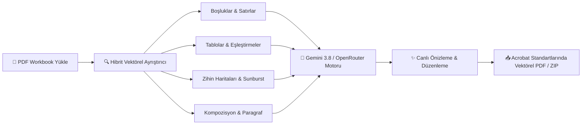

<div align="center">

# 🎓 PrepMate PDF
### *AI-Powered English Workbook & Homework Solver*

[-v1.0.2_Hazır-6366f1?style=for-the-badge&logo=windows&logoColor=white)](https://github.com/Rel0adediso/Prepmate-PDF/releases/latest)
[](https://github.com/Rel0adediso/Prepmate-PDF/releases)
[](https://python.org)
[](https://aistudio.google.com)
[](#)

<p align="center">
  <b>Üniversite hazırlık sınıfları ve yabancı dil okulları için geliştirilmiş otonom ödev çözücü.</b><br>
  150+ sayfalık kalın workbook PDF'lerini analiz eder, soruları doğal el yazısı hissiyle çözer ve <b>Adobe Acrobat ile doldurulmuş gibi</b> orijinal vektörel kalitede çıktısını verir.
</p>

---

### ⚡ [Hemen Windows EXE İndir (Kurulumsuz, Tek Tıkla Çalışır)](https://github.com/Rel0adediso/Prepmate-PDF/releases/latest)

</div>

---

## 🚀 10 Saniyede Başlatma (Hızlı Başlangıç)

> [!TIP]
> **Kod bilmenize, Python yüklemenize veya terminal açmanıza gerek yoktur!**
> 1. Yukarıdaki **[Windows İndir (.EXE)](https://github.com/Rel0adediso/Prepmate-PDF/releases/latest)** bağlantısından **`PrepMate-PDF.exe`** dosyasını indirin.
> 2. İndirdiğiniz dosyaya çift tıklayın. Program modern masaüstü penceresi olarak anında başlayacaktır.
> 3. Sağ üstteki **"🔑 AI Anahtarı"** butonuna tıklayıp [Google AI Studio](https://aistudio.google.com/app/apikey)'dan aldığınız ücretsiz anahtarı yapıştırın.

---

## 🌟 Neden PrepMate PDF? (Geleneksel Çözücüler vs PrepMate)

| Özellik | Sıradan OCR / AI Araçları | 🎓 PrepMate PDF v1.0.2 |
| :--- | :---: | :---: |
| **PDF Formatı & Kalite** | PDF'i bozar, bulanık resme çevirir | **Vektörel kalitede, orijinal çözünürlük korunur** |
| **Hizalama Hassasiyeti** | Yanıtlar satırların dışına taşar | **Piksel düzeyinde çizgi & kutu tespiti** |
| **Zihin Haritası & Diyagramlar** | Okuyamaz veya atlar | **Sunburst & örümcek diyagramlarını tam çözer** |
| **Hata Düzeltme (Editing)** | Sadece kelimeyi yazar | **5.8pt zarif öğretmen el yazısıyla satır üstü düzeltme** |
| **Çıktı Formatı** | Tüm kitabı baştan sona basar | **Yalnızca ödev olan sayfaları ayıklar veya tam kitap sunar** |
| **API Limit Koruması** | 429 hatasıyla çöker | **Kademeli worker + Akıllı cooldown + Otomatik retry** |
| **İnternet / Çerez Kesintisi** | Çözülen sayfalar kaybolur | **Kalıcı disk önbelleği (Cache) ile sayfalar korunur** |

---

## 🛠️ Çözüm & Soru Tipleri Yetenekleri



* **🧠 Zihin Haritası & Sunburst (Mind-Map):** Dairesel 8 kollu seyahat, kelime veya beyin fırtınası diyagramlarını merkezden dışa doğru doğru açılarla doldurur.
* **📝 Kompozisyon & Paragraf Kutuları:** *"Your Paragraph"*, *"Unit Task"* gibi açık uçlu yazma kutularına ünitenin dilbilgisine tam uyan, akıcı ve doğal öğrenci metinleri yazar.
* **📋 Liste Şablonları (Brainstorming Listing):** 1'den 10'a kadar numaralandırılmış beyin fırtınası satırlarına tekrara düşmeyen özgün fikir maddeleri üretir.
* **🔗 Fiil-İsim Eşleştirmeleri (Collocations):** Tablo alıştırmalarında tam fiil-nesne kalıplarını (örn. *pack a suitcase*, *exchange currency*) eksiksiz yerleştirir.
* **✍️ 5.8pt Hata Düzeltme (Editing Sections):** Üstü çizili veya yanlış kelimelerin hemen üzerine metinle çakışmayan temiz düzeltmeler kondurur.
* **🎯 Şık & Fiil Vurgulama:** Doğru seçeneğin altını çizme (*underline*) veya hafif saydam fosforlu vurgulama (*snug highlight*).

---

## 💻 Kullanım Kılavuzu

1. **Kitabı Yükleyin:** PDF dosyanızı pencereye sürükleyin veya *"🎯 Örnek İngilizce Ödev ile Hemen Dene"* butonuna basın.
2. **Ödev Sayfalarını Seçin:** Sayfa aralığı kutusuna ödev sayfalarınızı girin *(Örn: `12-18` veya `6, 9, 14, 28`)*.
3. **Çözdürün:** *"⚡ Sayfaları Getir ve Otomatik Çöz"* butonuna tıklayın. Sayfalar paralel worker'lar ile saniyeler içinde çözülür.
4. **Kontrol Edin & İnce Ayar Yapın:**
   - Cevapları fareyle istediğiniz yere sürükleyin veya üzerine çift tıklayarak metni düzenleyin.
   - Sayfanın üstüne ad, soyad ve numaranızı eklemek için **`+ Metin Kutusu Ekle`** butonunu kullanın.
5. **Dışa Aktarın:**
   - **📄 Sadece Ödev Sayfalarını İndir:** Hocanıza teslim etmelik derli toplu tek bir PDF üretir.
   - **📚 Tüm Kitabı İndir:** Tüm çalışma kitabının ilgili sayfalarını doldurup tam kitap olarak verir.
   - **🗂️ Toplu ZIP:** Birden fazla ödevi tek tıkla arşiv olarak indirir.

---

## ⌨️ Klavye Kısayolları

| Kısayol | Açıklama |
| :---: | :--- |
| `←` / `→` | Önceki / Sonraki sayfaya hızlı geçiş |
| `Delete` / `Backspace` | Seçili cevap kutusunu anında sil |
| `Escape` | Seçimi kaldır / Açık pencereleri kapat |

---

## 👨‍💻 Geliştiriciler İçin (Kaynak Koddan Çalıştırma)

Projeyi yerel ortamınızda kaynak kodundan çalıştırmak isterseniz:

```bash
# 1. Depoyu klonlayın
git clone https://github.com/Rel0adediso/Prepmate-PDF.git
cd Prepmate-PDF

# 2. Gereksinimleri yükleyin (veya kurulum.bat dosyasını çalıştırın)
pip install -r requirements.txt

# 3. Uygulamayı başlatın (veya baslat.bat dosyasını çalıştırın)
python desktop.py
```

Tek dosyalı EXE derlemek için:
```bash
derle_exe.bat
```

---

## 🛡️ Gizlilik & Güvenlik Garantisi (%100 Yerel)

> [!NOTE]
> * **Sıfır Bulut Kaydı:** Yüklediğiniz PDF'ler ve oluşturulan çözümler yalnızca kendi bilgisayarınızda (`localhost`) işlenir. Harici hiçbir sunucuya kaydedilmez.
> * **Güvenli API Anahtarı Saklama:** Girdiğiniz API anahtarları yalnızca kendi cihazınızda şifreli/yerel olarak saklanır; GitHub reposuna veya üçüncü şahıslara asla iletilmez.
> * **Açık Kaynak Kod:** Kod tabanında hiçbir telemetri, arka kapı veya kullanıcı takip kodu bulunmaz.

---

<div align="center">
  <sub>PrepMate PDF — Açık Kaynaklı Hazırlık & Workbook Asistanı • MIT Lisansı ile korunmaktadır.</sub>
</div>
